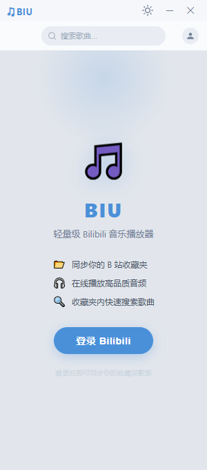
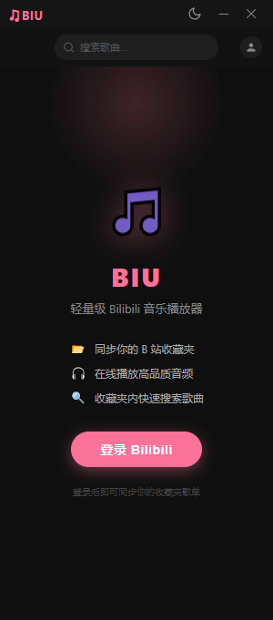
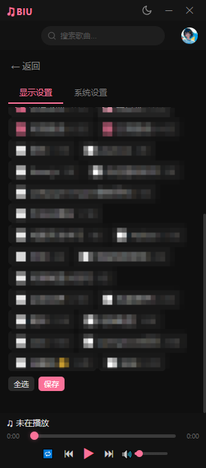

# 🎵 BIU Music Player

轻量级 Bilibili 音乐播放器桌面版，基于 Python + Flask + pywebview 构建。登录后从收藏夹中提取音频播放，常驻系统托盘，支持播放控制。

## 📸 预览

| | | | | |
|:---:|:---:|:---:|:---:|:---:|
|  |  |  |  |  |
| 浅色主题 | 欢迎页 | 收藏夹播放 | 歌词显示 | 收藏夹设置 |

## ✨ 特性

- **B站收藏夹音乐播放** — 登录后读取收藏夹，提取视频音频流（优先 FLAC 无损）
- **多源歌词** — 自动从网易云、QQ音乐、lrclib、B站字幕搜索歌词，支持手动切换和本地缓存
- **收藏夹搜索** — 支持在收藏夹内快速搜索歌曲
- **收藏夹显示管理** — 可隐藏不常用的收藏夹，保持列表清爽
- **深浅色主题** — 支持深色/浅色模式切换，保护眼睛
- **字体切换** — 支持多款中文字体，满足不同审美
- **系统托盘常驻** — 关闭窗口隐藏到托盘，托盘菜单支持上一首/下一首/暂停
- **无边框窗口** — 简洁的现代 UI，支持拖拽移动
- **单文件分发** — PyInstaller 打包为单个 EXE，无需安装 Python 环境

## 📦 快速开始

### 环境要求

- Python 3.10+
- Windows 10+（依赖 Edge WebView2）

### 安装依赖

```bash
pip install -r requirements.txt
```

### 运行

```bash
python main.py
```

### 打包为 EXE

```bash
pip install pyinstaller
pyinstaller BIU.spec --noconfirm
```

输出文件：`dist/BIU.exe`

## 🛠️ 技术栈

| 组件 | 用途 |
|------|------|
| Flask | 后端 API 路由 + 音频代理 |
| pywebview | 桌面窗口容器（Edge WebView2） |
| pystray | 系统托盘图标与菜单 |
| Pillow | 托盘图标处理 |
| requests | B站 API 请求 |

## 📁 项目结构

```
biu-python/
├── main.py          # 主入口：窗口管理、系统托盘、窗口吸附
├── bilibili.py      # B站 API 客户端（WBI 签名、收藏夹、播放地址）
├── routes.py        # Flask 路由注册 + JS API 桥接
├── lyrics_engine.py # 多源歌词引擎（网易云/QQ/lrclib/B站字幕 + 本地缓存）
├── templates/       # 前端 HTML 模板
├── static/
│   ├── css/         # 样式（style.css / _lyrics.css / _theme.css）
│   └── js/          # 逻辑（app.js / playlist.js / search.js / settings.js / lyrics.js）
├── .lyrics_cache/   # 歌词缓存目录（MD5 命名）
├── BIU.ico          # 应用图标
├── BIU.spec         # PyInstaller 打包配置
└── requirements.txt # Python 依赖
```

## 🎮 使用说明

1. **登录** — 从 B站网页获取 Cookie，粘贴 SESSDATA 到登录框
2. **浏览收藏夹** — 登录后可查看所有收藏夹及内容
3. **播放** — 点击歌曲开始播放，支持上一首/下一首、列表循环/单曲循环
4. **搜索** — 在搜索框输入关键词，实时过滤收藏夹内的歌曲
5. **歌词** — 点击底部歌名打开歌词面板，自动匹配或手动搜索切换歌词源
6. **收藏夹管理** — 进入设置，勾选/取消勾选收藏夹以控制显示
7. **主题切换** — 点击右上角月亮/太阳图标切换深浅色主题
8. **托盘控制** — 关闭窗口自动隐藏到托盘，右键托盘图标控制播放或退出

## ⌨️ 键盘快捷键

### 全局快捷键

| 快捷键 | 功能 |
|--------|------|
| 空格 | 播放 / 暂停 |
| →（右方向键） | 下一首 |
| ←（左方向键） | 上一首 |
| ↑（上方向键） | 音量 +5% |
| ↓（下方向键） | 音量 -5% |

> 输入框聚焦时快捷键不生效，避免干扰文字输入。

### 歌词页快捷键

| 快捷键 | 功能 |
|--------|------|
| Esc | 关闭歌词 / 关闭弹出的搜索面板或菜单 |
| [ / ] | 歌词时间偏移 -0.5s / +0.5s |
| T | 切换翻译模式（原文 → 原文+翻译 → 仅翻译） |
| O | 打开 / 关闭偏移量调整面板 |

> 歌词页快捷键仅在歌词全屏面板打开时生效。

## 📄 License

MIT
